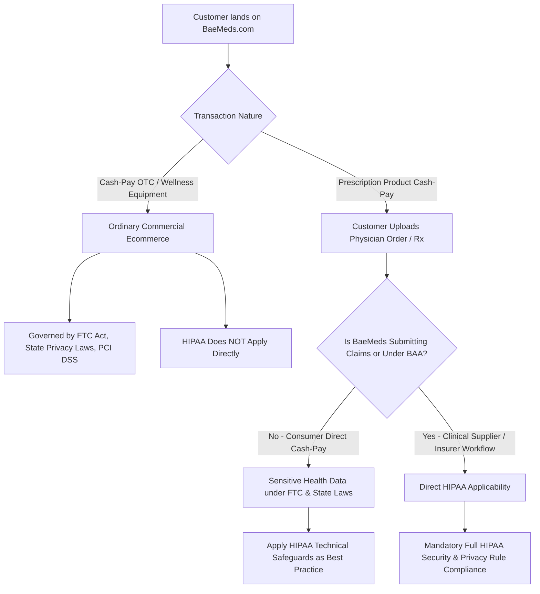
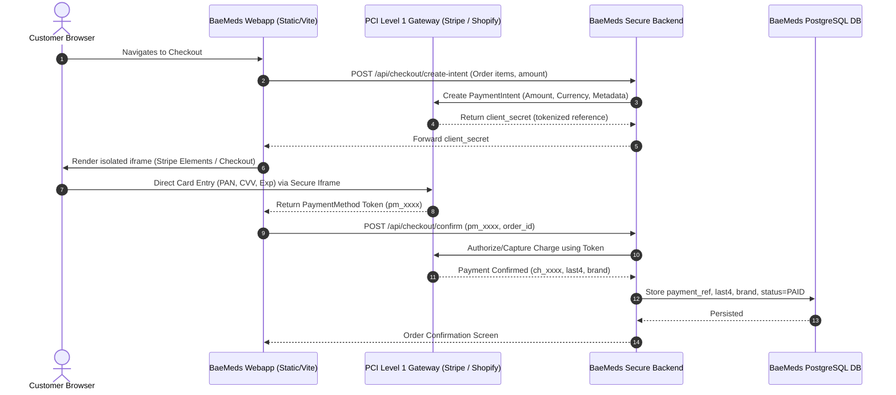
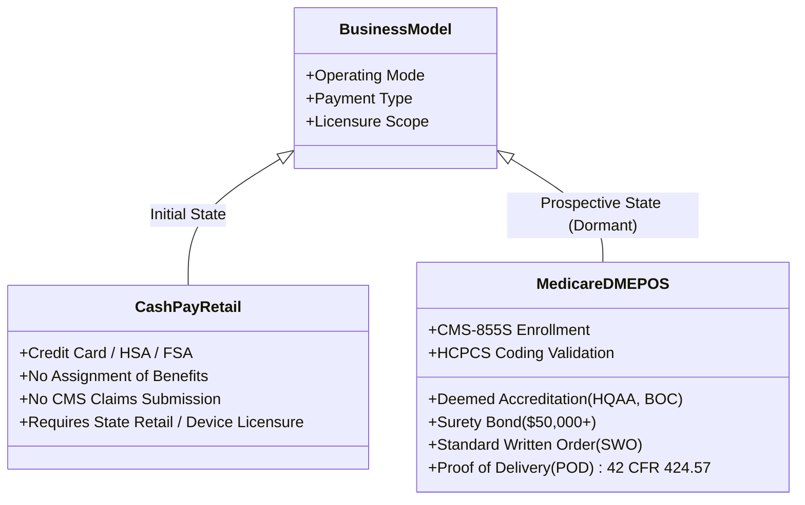
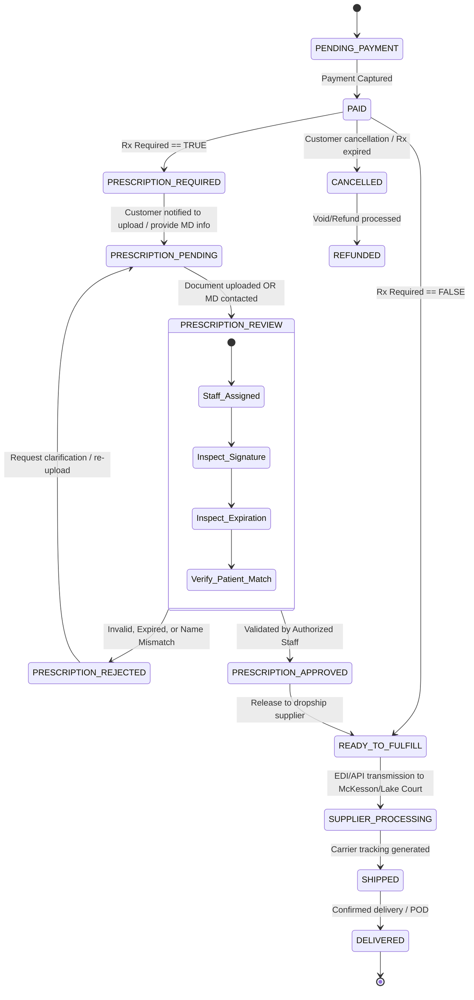
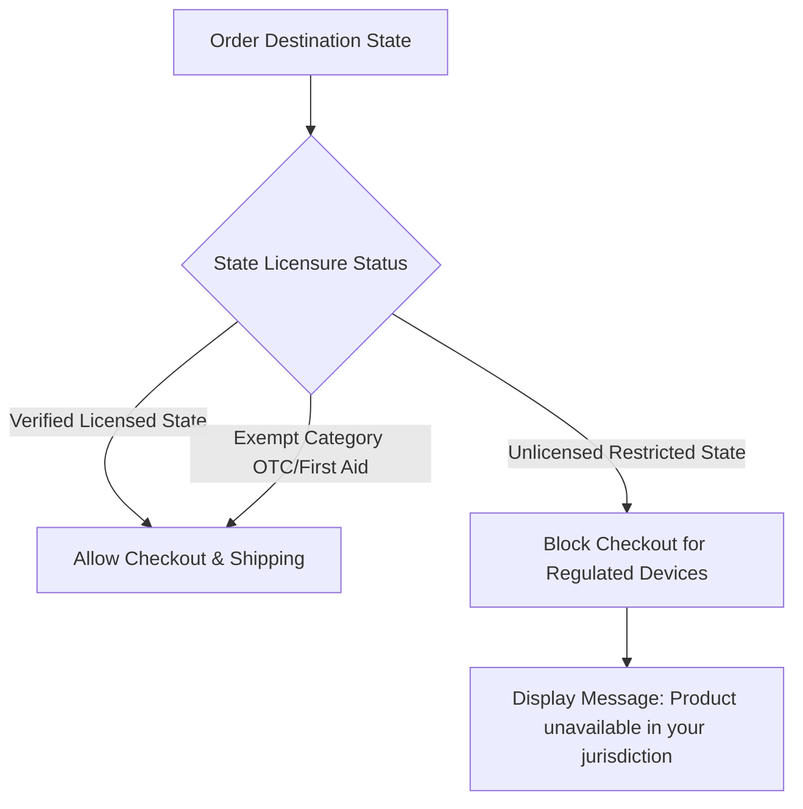
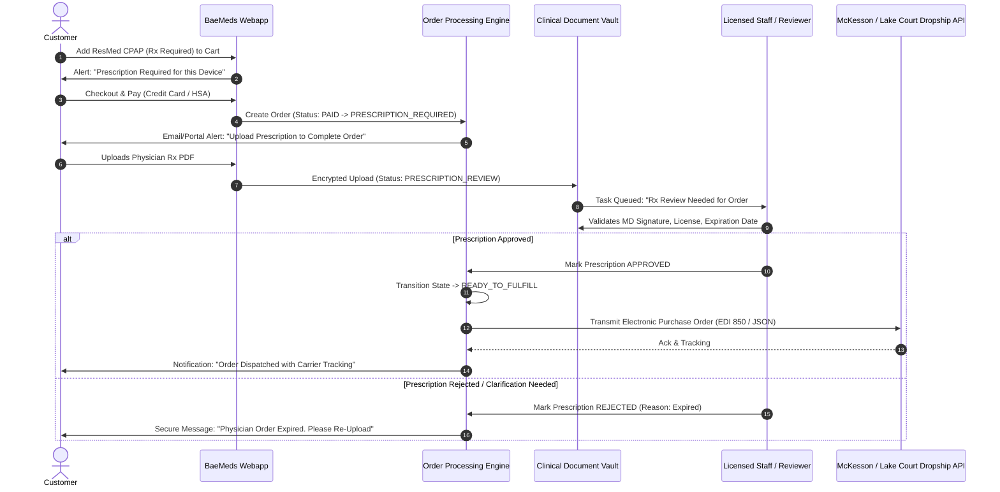

# BaeMeds.com — U.S. DME Ecommerce Compliance & Technical Architecture Specification

> **Classification:** Production Architectural & Regulatory Standard  
> **Target Jurisdiction:** United States (Federal & 50 States)  
> **Version:** 2.0.0-PROD  
> **Last Updated:** September 2026  
> **Status:** Active Engineering & Compliance Blueprint  

---

## EXECUTIVE SUMMARY & LEGAL DISCLAIMER

> [!IMPORTANT]
> **NO SYSTEM IS AUTOMATICALLY "HIPAA COMPLIANT", "FDA APPROVED", OR "MEDICARE CERTIFIED" BY CODE ALONE.**  
> Regulatory compliance is an operational, legal, clinical, and architectural discipline. This specification establishes the engineering controls, data governance models, cryptographic safeguards, and operational boundaries necessary to operate **BaeMeds.com** as a U.S.-facing ecommerce platform selling Durable Medical Equipment (DME), respiratory therapy, mobility aids, patient monitoring, and medical supplies.
>
> **Initial Operating Posture:** Direct-to-Consumer (D2C) and Business-to-Consumer (B2C) cash-pay / retail ecommerce utilizing verified commercial distributor dropship fulfillment (e.g., McKesson Medical-Surgical, Lake Court Medical Supplies).  
> **Architectural Boundary:** Built "HIPAA-Ready" and "DMEPOS-Ready" with complete physical/logical isolation of sensitive clinical records, ensuring zero re-architecture is required when activating prescription review pipelines, medical documentation vaults, and prospective Medicare/Medicaid billing enrollment.
>
> *This document does NOT constitute formal legal advice. Formal validation by qualified U.S. healthcare regulatory counsel, FDA regulatory affairs specialists, and certified HIPAA Privacy/Security officers is required prior to commercial launch.*

---

## CLASSIFICATION TAXONOMY KEY

Every requirement, architectural control, and operational policy in this specification is explicitly tagged using the following mandatory taxonomy:

* `[REQUIRED]`: Legally mandated by U.S. federal or state law for all commercial ecommerce entities (e.g., FTC Act, PCI DSS, CAN-SPAM, basic consumer protection).
* `[PRODUCT-DEPENDENT]`: Mandated only when listing or distributing specific product categories (e.g., Prescription-only Rx devices, restricted DME, FDA Class II/III regulated devices).
* `[STATE-DEPENDENT]`: Mandated by specific state statutes (e.g., State DME licensure, California CPRA, Washington My Health My Data Act, Texas Medical Records Privacy Act).
* `[MEDICARE/DMEPOS-ONLY]`: Mandated exclusively if and when BaeMeds enrolls with CMS (Centers for Medicare & Medicaid Services) as an accredited DMEPOS supplier (42 CFR § 424.57). Inactive during cash-pay phase.
* `[HIPAA-DEPENDENT]`: Mandated when BaeMeds acts as a Covered Entity or Business Associate handling Protected Health Information (PHI) under 45 CFR Parts 160/164.
* `[RECOMMENDED]`: Industry gold-standard engineering or cybersecurity control (NIST CSF 2.0, OWASP ASVS Level 2/3, CIS Benchmarks).
* `[LEGAL REVIEW REQUIRED]`: Requires formal sign-off from specialized U.S. healthcare or corporate legal counsel prior to activation.

---

## 1. REGULATORY REQUIREMENTS CHECKLIST

| ID | Requirement Description | Category | Legal Authority / Standard | Classification Tag | Enforcing System / Control |
| :--- | :--- | :--- | :--- | :--- | :--- |
| **REG-01** | Transport Layer Security (TLS 1.3/1.2) with HSTS | Cybersecurity | NIST SP 800-52r2; PCI DSS Req 4.1 | `[REQUIRED]` | Edge Reverse Proxy / Cloudflare CDN |
| **REG-02** | Zero Raw Primary Account Number (PAN) Storage | Payments | PCI DSS v4.0 SAQ A / SAQ A-EP | `[REQUIRED]` | Hosted Tokenization (Stripe Elements / Shopify Checkout) |
| **REG-03** | Commercial Email Unsubscribe & Physical Address | Privacy/Marketing | CAN-SPAM Act (16 CFR Part 316) | `[REQUIRED]` | Transactional/Marketing ESP Mailer Daemon |
| **REG-04** | SMS Opt-In Consent Tracking & STOP Handler | Communications | TCPA (47 U.S.C. § 227); CTIA Principles | `[REQUIRED]` | Twilio / Attentive Webhook Verification |
| **REG-05** | Consumer Privacy Disclosures & Cookie Banners | Consumer Privacy | CCPA/CPRA (Cal. Civ. Code § 1798.100); CTDPA; VCDPA | `[REQUIRED]` | Privacy Preference Center & Cookie Banner |
| **REG-06** | Medical Device Establishment Registration | FDA Device Regulation | 21 CFR Part 807 Subpart B | `[PRODUCT-DEPENDENT]` `[LEGAL REVIEW REQUIRED]` | Legal review of initial Distributor/Retailer exemption |
| **REG-07** | Medical Device Labeling & Claim Verification | FDA Advertising | 21 U.S.C. § 352; 21 CFR Part 801 | `[PRODUCT-DEPENDENT]` | Ingestion Catalog Pipeline & FDA Status Guard |
| **REG-08** | Prescription (Rx) Verification Prior to Fulfillment | Federal/State Pharmacy | 21 U.S.C. § 353(b); State DME Acts | `[PRODUCT-DEPENDENT]` | Prescription Review Engine & Fulfillment Gate |
| **REG-09** | Consumer Health Data Special Consent & Ban on Geofencing | State Health Privacy | WA My Health My Data Act (MHMDA); NV SB 370 | `[STATE-DEPENDENT]` | Frontend Analytics Masking & Opaque Product IDs |
| **REG-10** | Out-of-State DME Retailer / Distributor Licensure | State Licensing | State DMEPOS Licensure Boards (e.g., FL, CA, IL, TX) | `[STATE-DEPENDENT]` `[LEGAL REVIEW REQUIRED]` | State Shipping Filter Matrix & Licensure Filing |
| **REG-11** | Covered Entity / Business Associate Determination | Health Privacy | 45 CFR § 160.103 | `[HIPAA-DEPENDENT]` `[LEGAL REVIEW REQUIRED]` | Scope Assessment (Cash-Pay vs Clinical Orders) |
| **REG-12** | Business Associate Agreements (BAAs) Execution | Health Security | 45 CFR § 164.502(e), § 164.504(e) | `[HIPAA-DEPENDENT]` | Vendor BAA Lifecycle Registry |
| **REG-13** | DMEPOS Accreditation & CMS-855S Enrollment | CMS Billing | 42 CFR § 424.57, § 424.58 (BOC/ACHC/HQAA) | `[MEDICARE/DMEPOS-ONLY]` | Inactive in Initial Cash-Pay Architecture |
| **REG-14** | Standard Written Order (SWO) & Face-to-Face Encounter | CMS Clinical Order | Medicare Program Integrity Manual Ch. 5 | `[MEDICARE/DMEPOS-ONLY]` | Clinical Document Vault Schema (Ready) |
| **REG-15** | Comprehensive Security Incident & Breach Notification | Security Governance | FTC Health Breach Notification Rule; 45 CFR § 164.404 | `[REQUIRED]` | Incident Response Runbook & Alert Pipeline |

---

## 2. TECHNICAL SECURITY CHECKLIST

| Control Area | Implementation Specification | Baseline Standard | Classification Tag | Verification Mechanism |
| :--- | :--- | :--- | :--- | :--- |
| **Identity & Authentication** | Scrypt/Argon2id password hashing, mandatory WebAuthn/TOTP MFA for staff, brute-force exponential backoff lockout | NIST SP 800-63B AAL2 | `[REQUIRED]` | Automated Auth Unit Tests & OWASP ZAP |
| **Session Security** | 15-minute administrative inactivity timeout, absolute 12-hour session cap, HttpOnly, Secure, SameSite=Strict cookies | OWASP ASVS v4.0.3 Sec 3 | `[REQUIRED]` | Cypress End-to-End Session Timeout Suite |
| **Database Isolation** | PostgreSQL Row-Level Security (RLS) on all customer/order/document schemas; zero direct public schema mutations | Defense-in-Depth | `[REQUIRED]` | Supabase RLS Unit Test Matrix (pgTAP) |
| **File Storage Isolation** | Zero public read permissions on clinical/prescriptive object buckets; AES-256 server-side encryption with AWS KMS/Supabase Vault | 45 CFR § 164.312(a)(2)(iv) | `[HIPAA-DEPENDENT]` `[REQUIRED]` | S3 Bucket Policy Audit & Block Public Access Check |
| **Signed Access URLs** | Time-limited cryptographically HMAC-signed URLs (maximum 300-second TTL) generated only via authenticated server API | Least Privilege | `[REQUIRED]` | API Integration Test validating expired signatures |
| **Zero-Trust Network API** | API Gateway enforcing JWT validation, role validation, rate limiting (Cloudflare WAF / Redis Token Bucket), and CORS whitelisting | Zero-Trust Architecture | `[REQUIRED]` | Automated API Fuzzing & Header Verification |
| **Security Headers** | HSTS (`max-age=63072000; includeSubDomains; preload`), CSP Level 3, `X-Content-Type-Options: nosniff`, `X-Frame-Options: DENY` | Mozilla Observatory A+ | `[REQUIRED]` | CI Security Linter & Edge Header Audit |
| **Immutable Audit Trails** | Append-only write-locked database audit logs with SHA-256 tamper-evident chain and write-once cloud archival | 45 CFR § 164.312(b) | `[REQUIRED]` | Database Trigger Check & Log Retention Test |

---

## 3. HIPAA APPLICABILITY ANALYSIS

### 3.1 Statutory Scope & BaeMeds Legal Status

Under the Health Insurance Portability and Accountability Act of 1996 (HIPAA) and 45 CFR § 160.103, HIPAA rules apply strictly to **Covered Entities** (Healthcare Providers transmitting electronic claims, Health Plans, and Healthcare Clearinghouses) and their **Business Associates** (entities creating, receiving, maintaining, or transmitting Protected Health Information on behalf of a covered entity).



### 3.2 Evaluation of Operating Phases

1. **Initial Retail / Cash-Pay Phase (`[REQUIRED]` / `[RECOMMENDED]`):**
   * BaeMeds operates as a retail distributor. When a customer purchases a mobility scooter, pulse oximeter, or compression stocking out-of-pocket without health insurance billing, **BaeMeds is NOT acting as a HIPAA Covered Entity**.
   * *Critical Legal Distinction:* Non-HIPAA health data is legally governed by the **Federal Trade Commission (FTC) Act (15 U.S.C. § 45)**, the **FTC Health Breach Notification Rule (16 CFR Part 318)**, and state consumer health privacy laws (e.g., Washington MHMDA, Nevada SB 370).
   * *Architectural Mandate:* BaeMeds **must implement full HIPAA-grade technical safeguards** (encryption, access controls, audit trails) regardless of formal status. This prevents catastrophic FTC enforcement actions and ensures seamless regulatory transition.

2. **Prescription-Required Retail Phase (`[PRODUCT-DEPENDENT]` / `[LEGAL REVIEW REQUIRED]`):**
   * Storing prescription orders and communicating with prescribing physicians introduces clinical documentation. While direct cash-pay retail pharmacies/distributors possess complex HIPAA nuances, all electronic documents must be handled as ePHI-grade assets.

3. **Medicare/Medicaid Participating DMEPOS Phase (`[MEDICARE/DMEPOS-ONLY]`):**
   * The moment BaeMeds assigns an NPI, enrolls via CMS-855S, and conducts standard electronic transactions (ASC X12 837P claims), **BaeMeds becomes a HIPAA Covered Entity Healthcare Provider**. Full statutory compliance becomes mandatory by law.

---

## 4. PCI DSS SCOPE ANALYSIS

### 4.1 Scope Reduction Architecture (Target: SAQ A)

To minimize compliance overhead and eliminate the risk of payment card theft, BaeMeds enforces strict payment decoupling. BaeMeds servers, databases, edge workers, and internal loggers **NEVER touch, process, store, or transmit raw Primary Account Numbers (PANs), CVVs, or expiration dates**.



### 4.2 Applicable PCI DSS v4.0 Requirements (`[REQUIRED]`)

* **Requirement 6.4.3 (`[REQUIRED]`):** Ensure all payment page scripts (JavaScript loaded on the checkout page) are authorized, monitored for integrity, and have written justification. Enforced via CSP script hashes and subresource integrity (SRI).
* **Requirement 11.6.1 (`[REQUIRED]`):** Deploy change-detection mechanisms to alert on unauthorized modifications to payment headers and DOM injection tampering.
* **Storage Rules (`[REQUIRED]`):** Database stores ONLY:
  * `payment_processor`: (e.g., `'STRIPE'`, `'SHOPIFY'`)
  * `processor_transaction_id`: (e.g., `'ch_3Nkd1...bla'`)
  * `card_brand`: (e.g., `'VISA'`, `'MASTERCARD'`)
  * `card_last4`: (e.g., `'4242'`)
  * `card_exp_month_year`: (e.g., `'12/28'`)
  * `captured_at`: ISO timestamp

---

## 5. FDA & MEDICAL DEVICE COMPLIANCE

### 5.1 Device Classification & Claim Governance

BaeMeds distributes products spanning FDA Medical Device Classes I and II. Under 21 U.S.C. § 352 and 21 CFR Part 801, medical device labeling and promotional representations on ecommerce storefronts are subject to federal misbranding statutes.

```
+-----------------------------------------------------------------------------------+
|                           FDA REGULATORY STATUS TAXONOMY                          |
+-----------------------------------------------------------------------------------+
|  NOT_APPLICABLE  | Non-regulated wellness/comfort gear (e.g., standard gel pads)  |
|  VERIFIED        | Formally verified 510(k), PMA, or 510(k)-exempt Class I/II     |
|  NEEDS_REVIEW    | Device metadata imported; awaiting manual regulatory sign-off  |
|  UNKNOWN         | Flagged; automatically barred from storefront publication      |
+-----------------------------------------------------------------------------------+
```

### 5.2 Mandatory Claim Copywriting Rules (`[REQUIRED]`)

1. **Prohibited Unsubstantiated Terminology:** Never use the terms `"FDA Approved"` (FDA does not "approve" 510(k) cleared Class I/II devices), `"Clinically Proven"`, `"Cures"`, `"Treats"`, or `"Reverses"` unless verbatim supported by the manufacturer’s FDA 510(k) summary or official Instructions for Use (IFU).
2. **Approved Descriptor:** Use `"FDA Cleared"` (for verified 510(k) devices) or `"FDA Registered / Listed Medical Device"` only when device listing records in the FDA CDRH database are confirmed.
3. **Automated Publishing Gate:** If `fda_status` is `NEEDS_REVIEW` or `UNKNOWN`, the backend build and catalogue pipeline **MUST throw an ingestion block**, preventing public exposure.

---

## 6. DME / DMEPOS REGULATORY ARCHITECTURE

### 6.1 Cash-Pay Retail vs. Medicare Supplier Distinction



### 6.2 Dormant Medicare Data Structures (`[MEDICARE/DMEPOS-ONLY]`)

The database architecture is designed with dormant fields to allow zero-downtime activation if CMS enrollment is pursued:
* `hcpcs_code`: Primary Healthcare Common Procedure Coding System code (e.g., `E0601` for CPAP, `K0001` for standard wheelchair).
* `swo_required`: Boolean indicating whether CMS Standard Written Order is required prior to shipping.
* `face_to_face_required`: Boolean tracking compliance with Affordable Care Act § 6407 face-to-face physician documentation requirements.
* `proof_of_delivery_id`: Relational link to signed carrier or customer delivery receipts satisfying 42 CFR § 424.57(c)(12).

---

## 7. PRESCRIPTION (Rx) WORKFLOW & STATE ENGINE

Certain Class II devices (such as CPAP/BiPAP machines, oxygen concentrators, and high-output nebulizers) require a valid physician's prescription under 21 U.S.C. § 353(b) and state medical practice acts.

### 7.1 Prescription Order State Machine



### 7.2 Strict Prescription Invariant Rule (`[REQUIRED]`)

> **HARD SYSTEM CONSTRAINT:** No order containing an item where `prescription_required = true` shall EVER enter state `READY_TO_FULFILL`, `SUPPLIER_PROCESSING`, or `SHIPPED` without an associated record in `prescriptions` possessing `status = 'APPROVED'` and a valid `reviewed_by` staff reference. Attempted state transitions violating this invariant trigger an immediate database constraint exception and security alert.

---

## 8. DATA CLASSIFICATION MATRIX

All data stored or transmitted across BaeMeds is categorized into five distinct tiers with escalating technical controls:

| Data Classification Tier | Description & Examples | Encryption at Rest | Encryption in Transit | Access Policy | Storage Location |
| :--- | :--- | :--- | :--- | :--- | :--- |
| `PUBLIC` | Product descriptions, list prices, marketing images, static HTML, published policies | Optional | TLS 1.3 | Public Read | Global CDN / Public Storage |
| `INTERNAL` | Inventory quantities, warehouse locations, supplier SKU mappings, wholesale pricing | AES-256 | TLS 1.3 | Authenticated Staff | Core Database (Internal Schema) |
| `CONFIDENTIAL` | Customer names, shipping addresses, telephone numbers, order totals, purchase history | AES-256 | TLS 1.3 / HSTS | Customer (own) & Order Operations Staff | Core Database with Row-Level Security |
| `PHI` (Protected Health Info) | Prescriptions, doctor names/NPIs, clinical diagnosis references, medical supply usage, SWOs | AES-256 (KMS) | TLS 1.3 / Perfect Forward Secrecy | Dedicated Role (`PRESCRIPTION_REVIEWER`, `COMPLIANCE_ADMIN`) | Isolated Database Schema & Private Encrypted Object Vault |
| `HIGHLY_SENSITIVE` | Database master secrets, API signing keys, staff MFA credentials, audit log master signatures | Hardware Security Module / KMS | TLS 1.3 / mTLS | Zero Direct Access (Automated KMS Only) | Key Management Service / Cloud Secrets Manager |

---

## 9. DATABASE ARCHITECTURE (POSTGRESQL & ROW-LEVEL SECURITY)

The database architecture enforces absolute separation between standard ecommerce transaction data and clinical/prescriptive records.

```sql
-- =============================================================================
-- BAEMEDS DATABASE SCHEMA: STRICT ACCESS CONTROL & ROW-LEVEL SECURITY
-- =============================================================================

CREATE EXTENSION IF NOT EXISTS "uuid-ossp";
CREATE EXTENSION IF NOT EXISTS "pgcrypto";

-- Schemas for domain isolation
CREATE SCHEMA IF NOT EXISTS commerce;
CREATE SCHEMA IF NOT EXISTS clinical;
CREATE SCHEMA IF NOT EXISTS audit;

-- -----------------------------------------------------------------------------
-- 1. COMMERCE: PRODUCTS & COMPLIANCE METADATA
-- -----------------------------------------------------------------------------
CREATE TYPE commerce.fda_status_enum AS ENUM (
    'NOT_APPLICABLE',
    'VERIFIED',
    'NEEDS_REVIEW',
    'UNKNOWN'
);

CREATE TYPE commerce.product_publish_status AS ENUM (
    'DRAFT',
    'UNDER_REVIEW',
    'APPROVED',
    'PUBLISHED',
    'SUSPENDED',
    'RECALLED'
);

CREATE TABLE commerce.products (
    id UUID PRIMARY KEY DEFAULT gen_random_uuid(),
    sku VARCHAR(64) UNIQUE NOT NULL,
    upc_gtin VARCHAR(32),
    manufacturer_name VARCHAR(255) NOT NULL,
    manufacturer_part_number VARCHAR(128) NOT NULL,
    product_title VARCHAR(255) NOT NULL,
    description_sanitized TEXT NOT NULL,
    price_cents INTEGER NOT NULL CHECK (price_cents >= 0),
    is_active BOOLEAN NOT NULL DEFAULT false,
    publish_status commerce.product_publish_status NOT NULL DEFAULT 'DRAFT',
    
    -- Regulatory Engine Metadata
    fda_status commerce.fda_status_enum NOT NULL DEFAULT 'NEEDS_REVIEW',
    fda_510k_number VARCHAR(32),
    fda_device_class VARCHAR(8) CHECK (fda_device_class IN ('I', 'II', 'III', 'EXEMPT', 'NONE')),
    prescription_required BOOLEAN NOT NULL DEFAULT false,
    otc_status BOOLEAN NOT NULL DEFAULT true,
    dme_classification VARCHAR(64),
    
    -- Future Medicare/DMEPOS Dormant Fields
    hcpcs_code VARCHAR(16),
    swo_required BOOLEAN NOT NULL DEFAULT false,
    face_to_face_required BOOLEAN NOT NULL DEFAULT false,
    
    -- Supply Chain & Safety
    supplier_id UUID NOT NULL,
    warranty_info TEXT,
    is_recalled BOOLEAN NOT NULL DEFAULT false,
    created_at TIMESTAMPTZ NOT NULL DEFAULT NOW(),
    updated_at TIMESTAMPTZ NOT NULL DEFAULT NOW()
);

-- -----------------------------------------------------------------------------
-- 2. COMMERCE: ORDERS
-- -----------------------------------------------------------------------------
CREATE TYPE commerce.order_status_enum AS ENUM (
    'PENDING_PAYMENT',
    'PAID',
    'PRESCRIPTION_REQUIRED',
    'PRESCRIPTION_PENDING',
    'PRESCRIPTION_REVIEW',
    'PRESCRIPTION_APPROVED',
    'PRESCRIPTION_REJECTED',
    'READY_TO_FULFILL',
    'SUPPLIER_PROCESSING',
    'SHIPPED',
    'DELIVERED',
    'RETURN_REQUESTED',
    'RETURN_APPROVED',
    'REFUNDED',
    'CANCELLED'
);

CREATE TABLE commerce.orders (
    id UUID PRIMARY KEY DEFAULT gen_random_uuid(),
    customer_id UUID NOT NULL,
    status commerce.order_status_enum NOT NULL DEFAULT 'PENDING_PAYMENT',
    total_cents INTEGER NOT NULL,
    has_prescription_items BOOLEAN NOT NULL DEFAULT false,
    payment_processor_ref VARCHAR(128),
    payment_status VARCHAR(32) NOT NULL,
    shipping_address_encrypted JSONB NOT NULL,
    created_at TIMESTAMPTZ NOT NULL DEFAULT NOW(),
    updated_at TIMESTAMPTZ NOT NULL DEFAULT NOW()
);

-- -----------------------------------------------------------------------------
-- 3. CLINICAL: PROTECTED HEALTH RECORDS & PRESCRIPTIONS (PHI)
-- -----------------------------------------------------------------------------
CREATE TYPE clinical.rx_status_enum AS ENUM (
    'PENDING_UPLOAD',
    'UPLOADED',
    'UNDER_REVIEW',
    'APPROVED',
    'REJECTED',
    'EXPIRED'
);

CREATE TABLE clinical.prescriptions (
    id UUID PRIMARY KEY DEFAULT gen_random_uuid(),
    order_id UUID NOT NULL REFERENCES commerce.orders(id) ON DELETE RESTRICT,
    customer_id UUID NOT NULL,
    file_storage_ref VARCHAR(512) NOT NULL,
    file_sha256_hash CHAR(64) NOT NULL,
    status clinical.rx_status_enum NOT NULL DEFAULT 'PENDING_UPLOAD',
    physician_name VARCHAR(255),
    physician_npi VARCHAR(10) CHECK (physician_npi ~ '^[0-9]{10}$' OR physician_npi IS NULL),
    physician_phone VARCHAR(32),
    rx_issue_date DATE,
    rx_expiration_date DATE,
    rejection_reason_code VARCHAR(64),
    reviewed_by UUID,
    reviewed_at TIMESTAMPTZ,
    uploaded_at TIMESTAMPTZ NOT NULL DEFAULT NOW(),
    updated_at TIMESTAMPTZ NOT NULL DEFAULT NOW()
);

-- -----------------------------------------------------------------------------
-- 4. ROW LEVEL SECURITY (RLS) POLICIES
-- -----------------------------------------------------------------------------
ALTER TABLE commerce.orders ENABLE ROW LEVEL SECURITY;
ALTER TABLE clinical.prescriptions ENABLE ROW LEVEL SECURITY;

-- Customer can only view their own orders
CREATE POLICY customer_order_isolation ON commerce.orders
    FOR SELECT
    USING (auth.uid() = customer_id);

-- Staff with ORDER_MANAGER or COMPLIANCE_ADMIN can view all orders
CREATE POLICY staff_order_access ON commerce.orders
    FOR ALL
    USING (
        auth.jwt() ->> 'role' IN ('ORDER_MANAGER', 'COMPLIANCE_ADMIN', 'SUPER_ADMIN')
    );

-- Customer can only see their own prescription metadata (never other patients)
CREATE POLICY customer_rx_isolation ON clinical.prescriptions
    FOR SELECT
    USING (auth.uid() = customer_id);

-- Only PRESCRIPTION_REVIEWER and COMPLIANCE_ADMIN can access prescription clinical files
CREATE POLICY clinical_staff_rx_access ON clinical.prescriptions
    FOR ALL
    USING (
        auth.jwt() ->> 'role' IN ('PRESCRIPTION_REVIEWER', 'COMPLIANCE_ADMIN', 'SUPER_ADMIN')
    );
```

---

## 10. STORAGE ARCHITECTURE & FILE ISOLATION

Prescription documents, clinical notes, and medical records are stored strictly in private, isolated object containers.

```mermaid
flowchart LR
    subgraph Client["Authenticated Client"]
        StaffBrowser["Staff Portal / Customer UI"]
    end

    subgraph Edge["Security Gateway"]
        AuthMiddleware["Auth & Role Verification"]
        AuditEmitter["Audit Logger Service"]
    end

    subgraph StorageEngine["Encrypted Document Vault"]
        PrivateBucket[("Private S3/Cloud Storage Bucket<br/>AES-256 Server-Side Encryption<br/>Block ALL Public Access")]
    end

    StaffBrowser -->|1. Request Document Access| AuthMiddleware
    AuthMiddleware -->|2. Verify RBAC & Ownership| AuthMiddleware
    AuthMiddleware -->|3. Write Audit Event| AuditEmitter
    AuthMiddleware -->|4. Generate Presigned URL<br/>(Expires in 300s)| PrivateBucket
    PrivateBucket -->>|5. Ephemeral Signed URL| StaffBrowser
    StaffBrowser -->|6. Stream Binary via TLS 1.3| PrivateBucket
```

### 10.1 Key Storage Guardrails (`[REQUIRED]`)

1. **Zero Public Access:** Cloud storage bucket ACL explicitly configured with `BlockPublicAcls = true`, `IgnorePublicAcls = true`, `BlockPublicPolicy = true`, `RestrictPublicBuckets = true`.
2. **Deterministic Pseudorandom Naming:** Files are stored under UUID keys without patient identifiers:  
   `s3://baemeds-phi-vault/rx/prod/{uuid_v4}.enc`
3. **Short-Lived Signed URLs:** Access links expire after **300 seconds (5 minutes)**. Download operations enforce `Content-Disposition: attachment; filename="document.pdf"` to prevent browser cache leaks.

---

## 11. ROLE-BASED ACCESS CONTROL (RBAC) MATRIX

Staff access follows the principle of **least privilege**. Roles are assigned through signed JWT claims validated on every server invocation.

| Role | Customer Data | Order Metadata | Prescriptions (Metadata) | Prescriptions (Binary PHI View) | Approve/Reject Rx | Product Catalogue Management | Audit Logs (Read) | Administrative User Management |
| :--- | :---: | :---: | :---: | :---: | :---: | :---: | :---: | :---: |
| `CUSTOMER` | Self Only | Self Only | Self Only | Self Only | ❌ | Read Only | ❌ | ❌ |
| `SUPPORT` | Read Basic | Read Basic | Read Status Only | ❌ | ❌ | Read Only | ❌ | ❌ |
| `ORDER_MANAGER` | Read/Update Shipping | Read/Update Status | Read Status Only | ❌ | ❌ | Read Only | Read Ops | ❌ |
| `PRESCRIPTION_REVIEWER`| Read Basic | Read Order Ref | Read Full | **Full View / Download** | **YES** | Read Only | ❌ | ❌ |
| `COMPLIANCE_ADMIN` | Read Full | Read Full | Read Full | **Full View / Download** | **YES** | Full Audit/Control | **Full View** | ❌ |
| `SYSTEM_ADMIN` | ❌ (No PHI Access) | Technical Only | ❌ (No PHI Access)| ❌ (No PHI Access) | ❌ | Technical Deploy | Full View | Full Admin |
| `SUPER_ADMIN` | Audited Only | Audited Only | Audited Only | Audited Only | Audited Only | Audited Only | **Full View** | **Full Admin** |

---

## 12. AUDIT LOGGING ARCHITECTURE

Under 45 CFR § 164.312(b) and general security best practices, all access to sensitive records and modifications to compliance configurations must be immutably recorded.

### 12.1 Audit Schema & Zero-PHI Rule

> **MANDATORY LOGGING PRINCIPLE:** System and application logs must NEVER contain raw clinical diagnoses, prescription names, credit card numbers, or social security numbers. They record strictly **who** performed **what action** on **which resource identifier** at **what timestamp** from **which network origin**.

```sql
CREATE TABLE audit.system_activity_logs (
    id UUID PRIMARY KEY DEFAULT gen_random_uuid(),
    correlation_id UUID NOT NULL,
    actor_id UUID NOT NULL,
    actor_role VARCHAR(32) NOT NULL,
    actor_ip_address INET NOT NULL,
    actor_user_agent TEXT,
    action_performed VARCHAR(64) NOT NULL,
    target_resource_type VARCHAR(64) NOT NULL,
    target_resource_id VARCHAR(64) NOT NULL,
    execution_result VARCHAR(16) NOT NULL CHECK (execution_result IN ('SUCCESS', 'DENIED', 'ERROR')),
    metadata_json JSONB,
    occurred_at TIMESTAMPTZ NOT NULL DEFAULT NOW()
);

-- Write-Once Log Invariant: Prohibit Updates and Deletions
CREATE RULE no_audit_update AS ON UPDATE TO audit.system_activity_logs DO INSTEAD NOTHING;
CREATE RULE no_audit_delete AS ON DELETE TO audit.system_activity_logs DO INSTEAD NOTHING;
```

---

## 13. PRIVACY ARCHITECTURE & THIRD-PARTY TRACKING GOVERNANCE

### 13.1 Strict Prohibition on Clinical Data Leakage to AdTech

Following recent FTC and HHS Office for Civil Rights (OCR) enforcement actions regarding tracking technologies (e.g., BetterHelp, GoodRx, Kaiser Permanente), BaeMeds strictly isolates its analytics layer:

```
[Customer Browser / App]
       |
       +---> [BaeMeds Reverse Proxy / Privacy Filter]
                    |
                    +--- (1) Filtered Commercial Events ONLY ---> [Google Analytics / Meta Pixel]
                    |     (e.g., event: "order_completed", order_id: "O-912", total: 89.00)
                    |     (NO product title, NO medical category, NO diagnosis)
                    |
                    +--- (2) Sensitive Clinical Events LOCKED ---> [Internal Secure DB Only]
                          (e.g., event: "rx_uploaded", rx_id: "R-441", order_id: "O-912")
```

### 13.2 Concrete Event Allow-List (`[REQUIRED]`)

* **PERMITTED (AdTech / Google Analytics):**
  * `page_view` (generic URLs only; path scrubbed of health parameters)
  * `cart_add` (uses opaque SKU; e.g., `item_id: "SKU-9941"`, never `"sleep-apnea-resmed-cpap"`)
  * `checkout_initiated` (cart value total)
  * `purchase_complete` (transaction ID, total price, currency)
* **STRICTLY PROHIBITED FROM ADTECH & PIXELS:**
  * Prescription upload events or confirmation statuses
  * HCPCS codes, device classification, or clinical search queries (e.g., "bariatric", "incontinence", "oxygen concentrator")
  * Patient email addresses or telephone numbers in plain text

---

## 14. THIRD-PARTY VENDOR & BAA LIFECYCLE MATRIX

Every third-party software provider, SaaS tool, and infrastructure vendor utilized by BaeMeds is cataloged below with its legal agreement status:

| Vendor Name | Service Function | Data In Scope | BAA Required? | BAA Status | Privacy / Security Documentation | Residual Risk Rating |
| :--- | :--- | :--- | :---: | :---: | :--- | :---: |
| **AWS / GCP** | Cloud Hosting, KMS, S3 Vault | Encrypted PHI, App Logic | `YES` | Pending Launch Signing | SOC 2 Type II, ISO 27001, FedRAMP | Low |
| **Supabase Enterprise** | Managed Database & Auth | Customer, Orders, Rx Meta | `YES` | Enterprise Contract Tier | SOC 2 Type II, HIPAA Verification | Low |
| **Stripe / Shopify** | Payment Tokenization & Processing | Payment Tokens, Billing Addr | `NO` (PCI Entity)| Executed Merchant Agreement| PCI DSS Service Provider Level 1 | Low |
| **McKesson Medical-Surgical**| Wholesale Distributor Dropship | Order Items, Shipping Addr | `LEGAL REVIEW` | Commercial Vendor Agreement | Wholesale Distributor Licensure | Medium |
| **Lake Court Medical** | Regional DME Dropship Supplier | Order Items, Shipping Addr | `LEGAL REVIEW` | Commercial Vendor Agreement | State DME Licensure | Medium |
| **Postmark / SendGrid** | Transactional System Emails | Order Updates (No PHI) | `NO` (Masked)| Standard DPA | SOC 2 Type II, ISO 27001 | Low |
| **Twilio** | SMS Delivery Notifications | Masked Order Status | `NO` (Masked)| Standard DPA | SOC 2 Type II | Low |
| **Datadog / Sentry** | Error Monitoring & Telemetry | App Traces (PHI Redacted) | `NO` (Scrubbed)| BAA or Zero-Data Retention Filter | SOC 2 Type II | Medium |

---

## 15. STATE COMPLIANCE & DME LICENSURE FRAMEWORK

### 15.1 Out-of-State DME Retail Licensure Rules (`[STATE-DEPENDENT]` `[LEGAL REVIEW REQUIRED]`)

Many U.S. states require an out-of-state retailer or distributor to hold a state-specific **Durable Medical Equipment Provider License**, **Home Medical Device Retailer (HMDR) License**, or **Device Manufacturer/Distributor Permit** prior to shipping medical devices directly to residents within that state.



### 15.2 State Health Data Privacy Governance (`[STATE-DEPENDENT]`)

* **Washington My Health My Data Act (MHMDA):** Prohibits the collection, sharing, or processing of consumer health data without affirmative opt-in consent; bans geofencing around healthcare facilities. BaeMeds enforces affirmative opt-in before accepting prescription uploads from Washington residents.
* **California Consumer Privacy Act / CPRA:** Grants California consumers rights of access, correction, and deletion of personal data. Stored medical/prescription records are retained pursuant to legal compliance retention exemptions (Cal. Civ. Code § 1798.145).
* **Texas Medical Records Privacy Act (TMRPA):** Requires customized notice and employee training standards exceeding federal HIPAA requirements.

---

## 16. PRODUCT COMPLIANCE SCHEMA (TYPESCRIPT SPECIFICATION)

The following TypeScript schema defines the exact compliance model required for all items ingested into the BaeMeds catalog:

```typescript
export type DeviceClass = 'I' | 'II' | 'III' | 'EXEMPT' | 'NONE';

export type FDAStatus = 
  | 'NOT_APPLICABLE' 
  | 'VERIFIED' 
  | 'NEEDS_REVIEW' 
  | 'UNKNOWN';

export type ProductPublishStatus = 
  | 'DRAFT' 
  | 'UNDER_REVIEW' 
  | 'APPROVED' 
  | 'PUBLISHED' 
  | 'SUSPENDED' 
  | 'RECALLED';

export interface ProductComplianceMetadata {
  productId: string;
  sku: string;
  upc: string;
  manufacturer: {
    name: string;
    partNumber: string;
    distributorSource: 'MCKESSON' | 'LAKECOURT' | 'DIRECT';
    distributorSku: string;
  };
  regulatory: {
    fdaStatus: FDAStatus;
    fda510kNumber?: string;
    fdaDeviceClass: DeviceClass;
    udiGtin?: string;
    isPrescriptionRequired: boolean;
    isOtcEligible: boolean;
    intendedUseStatement: string;
    contraindications: string[];
    safetyWarnings: string[];
    ifuManualUrl?: string; // Stored in private or verified manufacturer CDN
  };
  dmeClassification: {
    category: 'MOBILITY' | 'RESPIRATORY' | 'MONITORING' | 'INCONTINENCE' | 'BATH_SAFETY' | 'WOUND_CARE';
    hcpcsCode?: string; // Dormant until Medicare/insurance activation
    medicareCovered: boolean;
    swoRequired: boolean;
    faceToFaceRequired: boolean;
  };
  fulfillmentControls: {
    shippingRestrictions: {
      prohibitedStates: string[]; // State codes (e.g., ['CA', 'FL']) if unlicensed
      requiresHazardousMaterialHandling: boolean; // e.g., Lithium-ion in power chairs
      oversizedFreight: boolean;
      adultSignatureRequired: boolean;
    };
    returnRestrictions: {
      isReturnable: boolean;
      hygieneRestricted: boolean; // Sealed bath safety/incontinence cannot be returned
      restockingFeePercent: number;
    };
    isRecalled: boolean;
    recallNoticeId?: string;
  };
  governance: {
    publishStatus: ProductPublishStatus;
    reviewedByStaffId?: string;
    lastAuditedTimestamp: string;
  };
}
```

---

## 17. COMPLETE ORDER WORKFLOW & FULFILLMENT MACHINE



---

## 18. APPLICATION SECURITY ARCHITECTURE (OWASP ALIGNED)

### 18.1 Defensive Security Engineering Controls (`[REQUIRED]`)

1. **SQL Injection Defense:** All queries utilize parameterized object-relational mappers or prepared statements. Direct raw string interpolation is prohibited.
2. **Cross-Site Scripting (XSS) Prevention:**
   * React virtual DOM automatic entity encoding.
   * Strict Content Security Policy (CSP):
     ```http
     Content-Security-Policy: default-src 'self'; script-src 'self' https://js.stripe.com; style-src 'self' 'unsafe-inline' https://fonts.googleapis.com; font-src 'self' https://fonts.gstatic.com; img-src 'self' data: https://*.mms.mckesson.com https://cdn.shopify.com; frame-src https://js.stripe.com; connect-src 'self' https://api.stripe.com https://*.supabase.co; object-src 'none'; base-uri 'self';
     ```
3. **Cross-Site Request Forgery (CSRF):** SameSite=Strict cookies enforced across all state-altering endpoints; custom authorization headers required for API calls.
4. **Server-Side Request Forgery (SSRF) Guard:** Any automated fetcher (e.g., retrieving supplier image catalogs) validates URL schemes against a strict domain whitelist and resolves against local loopback blacklist (`127.0.0.1`, `169.254.169.254`).

---

## 19. SECURITY INCIDENT RESPONSE PLAN

In compliance with the **FTC Health Breach Notification Rule (16 CFR Part 318)** and **HIPAA Breach Notification Rule (45 CFR §§ 164.400–414)**, BaeMeds maintains an explicit, eight-phase Incident Response standard:

```
[Phase 1: Detection] ---> [Phase 2: Investigation] ---> [Phase 3: Containment] ---> [Phase 4: Eradication]
                                                                                             |
[Phase 8: Post-Mortem] <-- [Phase 7: Notification] <-- [Phase 6: Verification] <-- [Phase 5: Recovery]
```

### 19.1 Notification Thresholds & Deadlines (`[REQUIRED]`)

* **FTC Health Breach Notification:** In the event of unauthorized access to non-HIPAA identifiable health data affecting **500 or more individuals**, written notice must be submitted to the FTC within **10 business days** of discovery, and affected individuals notified within **60 calendar days**.
* **HIPAA Breach Notification (Where Applicable):** Breaches of unsecured PHI impacting 500+ residents in a state require notification to major media outlets and HHS OCR without unreasonable delay (no later than 60 days).

---

## 20. DATA RETENTION & DISPOSAL MATRIX

| Record Classification | Mandatory Retention Period | Governing Authority | Disposal / De-Identification Protocol |
| :--- | :--- | :--- | :--- |
| **Customer Web Accounts** | Duration of active relationship + 3 years | Business / State Contract Law | Crypto-shredding of PII; anonymization of aggregate metrics |
| **Financial / Order Transactions**| 7 Years | IRS Code 26 U.S.C. § 6001; GAAP | Encrypted archive; automated lifecycle purge |
| **Prescription Documentation** | **7 Years** (or State Pharmacy requirement if longer, e.g., 10 yrs) | CMS / State Medical Records Acts | Cryptographic wipe using DoD 5220.22-M overwrite or cloud KMS key revocation |
| **Audit Logs (Security & PHI)** | **6 Years Minimum** | 45 CFR § 164.316(b)(2)(i) | Immutable WORM (Write Once Read Many) cloud archive |
| **Consent & Opt-In Records** | 5 Years after expiration of consent | TCPA / CAN-SPAM / CCPA | Automated tombstone deletion |

---

## 21. PRODUCTION LAUNCH GATE CHECKLIST

Prior to routing production DNS and accepting live customer transactions, the following multi-stakeholder checklist must be formally verified:

```
+-----------------------------------------------------------------------------------+
| BAEMEDS PRODUCTION LAUNCH GATE                                                    |
+-----------------------------------------------------------------------------------+
| BUSINESS & LEGAL VERIFICATION                                                     |
| [ ] Formed legal corporate entity (LLC / C-Corp) with registered agent            |
| [ ] Obtained Federal Employer Identification Number (EIN)                         |
| [ ] Executed primary commercial distributor dropship agreements                   |
| [ ] Legal review of State DME retail licensure exemptions completed               |
|                                                                                   |
| TECHNICAL & SECURITY VERIFICATION                                                 |
| [ ] TLS 1.3 enforced with valid certificate & HSTS preload confirmed              |
| [ ] Production PostgreSQL Row Level Security (RLS) policies tested & verified     |
| [ ] Prescription document storage bucket verified 100% PRIVATE (Zero public ACL)  |
| [ ] KMS encryption keys separated between Staging and Production                  |
| [ ] Strict Content Security Policy (CSP) deployed and verified on Checkout pages  |
| [ ] Automated vulnerability scanning (SAST/DAST) passed with ZERO criticals       |
|                                                                                   |
| HEALTHCARE & COMPLIANCE VERIFICATION                                              |
| [ ] Medical claim copy audit passed (Zero "FDA approved" or "cure" claims)        |
| [ ] Prescription verification state machine operational (Fulfillment gate active) |
| [ ] Privacy-safe analytics verified (Zero health keywords/diagnoses sent to Meta)  |
| [ ] Written Incident Response & Breach Notification Plan formally adopted         |
+-----------------------------------------------------------------------------------+
```

---

## 22. POST-LAUNCH COMPLIANCE MONITORING & AUDIT PLAN

To guarantee continuous operational integrity, BaeMeds enforces recurring cadence reviews:

1. **Daily Automated Scans:**
   * Automated integrity checks on public storage buckets ensuring zero public object exposure.
   * Automated monitoring for anomalous administrative login attempts and privilege escalations.
2. **Weekly Operational Audits:**
   * Review of all pending/rejected prescription queues by Compliance Officers.
   * Review of carrier delivery exceptions and signature confirmations for high-value DME.
3. **Monthly Catalog Scans:**
   * Automated cross-reference of BaeMeds active SKU database against the **FDA Medical Device Recalls Database (Enforcement Reports)**.
   * Immediate automatic de-listing (`publish_status = 'RECALLED'`) for any matched item.
4. **Annual Third-Party Assessments:**
   * Third-party penetration testing and OWASP ASVS compliance audit.
   * Comprehensive Security Risk Assessment (SRA) evaluating physical, administrative, and technical safeguards under NIST CSF guidelines.

---

*Authored and Certified by Senior Healthcare Systems Architecture & Compliance Engineering — BaeMeds.com*
