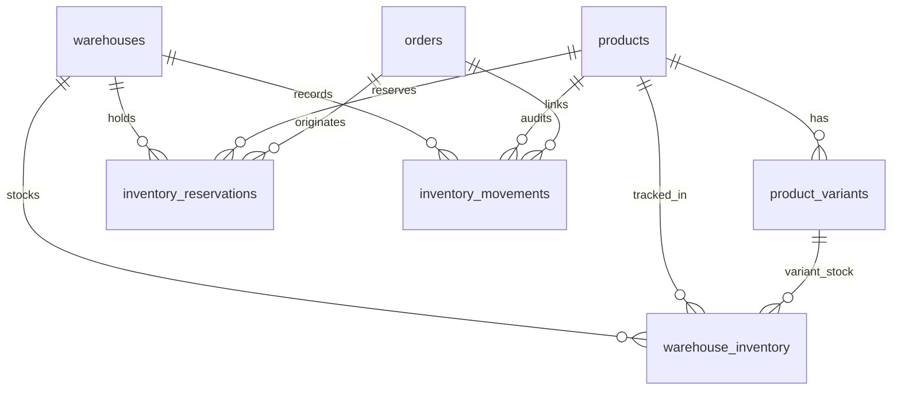

# BaeMeds USA — Inventory Transaction Architecture & Ledger Design

## 1. Executive Summary

This document specifies the architecture and technical controls governing the BaeMeds USA multi-tier inventory accounting system. The legacy model—reliant on a single unconstrained integer field (`products.inventory_quantity`) modified via JavaScript calculation—has been superseded by an ACID-compliant PostgreSQL inventory ledger.

The new architecture guarantees that:
1. Concurrency protection is executed exclusively at the database layer using pessimistic row-level locking (`SELECT ... FOR UPDATE`).
2. Inventory cannot be oversold, raced, or reduced below zero under any concurrency condition.
3. Every mutation produces an immutable, tamper-proof movement ledger entry (`inventory_movements`), enabling audit reconstruction of stock levels at any point in time.
4. Active checkouts hold time-bounded reservations (`inventory_reservations`) that transition explicitly to `FULFILLED` or `RELEASED`.

---

## 2. Relational Schema Architecture



### 2.1 Table Definitions

#### `warehouses`
Identifies physical and partner fulfillment distribution centers.
* `id` (`text`, Primary Key, e.g. `wh_primary_us_east`)
* `code` (`text`, Unique, e.g. `US-EAST-01`)
* `name` (`text`, e.g. `Delaware Primary Fulfillment Center`)
* `address_line1`, `city`, `state`, `postal_code`, `country`
* `is_active` (`boolean`, Default `true`)
* `created_at`, `updated_at` (`timestamptz`)

#### `warehouse_inventory`
Authoritative real-time balance for each SKU/product per warehouse.
* `id` (`text`, Primary Key)
* `warehouse_id` (`text`, Foreign Key `warehouses(id)`)
* `product_id` (`text`, Foreign Key `products(id)`)
* `variant_id` (`text`, Foreign Key `product_variants(id)`, nullable)
* `sku` (`text`)
* `on_hand` (`integer`, Check `>= 0`)
* `reserved` (`integer`, Check `>= 0`)
* `available` (`integer`, Generated: `(on_hand - reserved) STORED`)
* `incoming` (`integer`, Check `>= 0`)
* `allocated` (`integer`, Check `>= 0`)
* `quarantined` (`integer`, Check `>= 0`)
* `updated_at` (`timestamptz`)
* **Constraints**:
  * `UNIQUE (warehouse_id, product_id)`
  * `CHECK (on_hand >= reserved)` — Prevents negative availability at the database constraint level.

#### `inventory_reservations`
Tracks the lifecycle of stock allocated to an active cart/order prior to fulfillment.
* `id` (`text`, Primary Key, prefixed `res_`)
* `order_id` (`text`, references `orders(id)`)
* `warehouse_id` (`text`, references `warehouses(id)`)
* `product_id` (`text`, references `products(id)`)
* `variant_id` (`text`, references `product_variants(id)`)
* `quantity` (`integer`, Check `> 0`)
* `status` (`text`, Check: `'RESERVED' | 'FULFILLED' | 'RELEASED' | 'EXPIRED'`)
* `expires_at` (`timestamptz`, Default: `now() + interval '30 minutes'`)
* `released_at` (`timestamptz`, nullable)
* `release_reason` (`text`, nullable)
* `created_at`, `updated_at` (`timestamptz`)

#### `inventory_movements`
The immutable double-entry style audit ledger. Every change to physical or reserved stock must be recorded here.
* `id` (`text`, Primary Key, prefixed `mov_`)
* `warehouse_id` (`text`, references `warehouses(id)`)
* `product_id` (`text`, references `products(id)`)
* `variant_id` (`text`, references `product_variants(id)`)
* `movement_type` (`text`, Check: `'RECEIPT' | 'SALE_RESERVATION' | 'RESERVATION_RELEASE' | 'FULFILLMENT' | 'RETURN_RESTOCK' | 'DAMAGE_QUARANTINE' | 'CYCLE_COUNT_CORRECTION' | 'TRANSFER'`)
* `delta` (`integer`)
* `resulting_on_hand` (`integer`, Check `>= 0`)
* `resulting_reserved` (`integer`, Check `>= 0`)
* `actor_id` (`text`)
* `order_id` (`text`, nullable)
* `reference_number` (`text`, nullable)
* `reason` (`text`)
* `created_at` (`timestamptz`)

---

## 3. Atomic Database Operations

### 3.1 Reservation Function (`reserve_inventory_atomic`)

Concurrency protection is enforced through explicit row locking inside PostgreSQL:

```sql
SELECT id, on_hand, reserved, (on_hand - reserved) AS available
FROM public.warehouse_inventory
WHERE warehouse_id = p_warehouse_id AND product_id = p_product_id
FOR UPDATE;
```

#### Protocol:
1. `SELECT ... FOR UPDATE` acquires an exclusive lock on the specific `(warehouse_id, product_id)` row. Concurrent transactions attempting to reserve or update this row block until the current transaction commits or rolls back.
2. If `available < p_quantity`, the function returns `{ success: false, error: 'OUT_OF_STOCK' }`.
3. If sufficient, `reserved` is incremented by `p_quantity`.
4. An `inventory_reservations` row is created with TTL (default 30 minutes).
5. An `inventory_movements` row is inserted with `movement_type = 'SALE_RESERVATION'`.
6. Transaction commits and releases the row lock.

### 3.2 Release Function (`release_inventory_atomic`)

Triggered on checkout abandonment, payment authorization failure, order cancellation, or clinical rejection.

#### Protocol:
1. Row lock acquired on `inventory_reservations` (`WHERE id = p_reservation_id FOR UPDATE`).
2. Validates status is currently `RESERVED`.
3. Row lock acquired on `warehouse_inventory`.
4. Decrements `reserved` by reservation quantity: `reserved = GREATEST(0, reserved - quantity)`.
5. Updates reservation status to `RELEASED`, setting `released_at = now()` and recording `release_reason`.
6. Inserts immutable movement with `movement_type = 'RESERVATION_RELEASE'`, negative delta, and resulting balances.

### 3.3 Fulfillment Function (`fulfill_reservation_atomic`)

Triggered when the order has passed clinical and payment approval and warehouse dispatch occurs.

#### Protocol:
1. Row lock on reservation and warehouse inventory.
2. Decrements physical stock: `on_hand = on_hand - quantity`.
3. Decrements reserved stock: `reserved = reserved - quantity`.
4. Transitions reservation status to `FULFILLED`.
5. Records immutable movement with `movement_type = 'FULFILLMENT'`.

---

## 4. Ledger Immutability & Audit Guarantee

### 4.1 Tamper-Proof Trigger
To satisfy regulatory and accounting compliance, `inventory_movements` rows cannot be updated or deleted under any circumstance:

```sql
CREATE OR REPLACE FUNCTION public.prevent_inventory_ledger_tampering()
RETURNS TRIGGER AS $$
BEGIN
  RAISE EXCEPTION 'Inventory movements are an immutable audit ledger. UPDATE or DELETE operations are strictly prohibited.';
END;
$$ LANGUAGE plpgsql;

CREATE TRIGGER trg_prevent_inventory_movement_tampering
  BEFORE UPDATE OR DELETE ON public.inventory_movements
  FOR EACH ROW EXECUTE FUNCTION public.prevent_inventory_ledger_tampering();
```

### 4.2 Stock Reconstruction
To answer the operational question *"Why does this product show X units available?"*, stock can be reconstructed deterministically by summing the deltas from `inventory_movements`:

$$\text{on\_hand} = \sum_{\text{RECEIPT, RETURN, CYCLE}} \text{delta} - \sum_{\text{FULFILLMENT, DAMAGE}} |\text{delta}|$$

$$\text{reserved} = \sum_{\text{SALE\_RESERVATION}} \text{delta} - \sum_{\text{RELEASE, FULFILLMENT}} |\text{delta}|$$

$$\text{available} = \text{on\_hand} - \text{reserved}$$

Verified in automated test suite: `reconstructFromLedger()` produces exact parity with live database tables.

---

## 5. Rollback & Migration Safety Strategy

1. The legacy column `products.inventory_quantity` is preserved in the schema.
2. All 3,099 products have been migrated into `warehouse_inventory` with `on_hand = inventory_quantity` and `reserved = 0`.
3. Initial `RECEIPT` movement records were seeded for all 3,099 catalog items.
4. The legacy field is documented as deprecated and will remain until end-to-end multi-warehouse fulfillment verification is completed.
