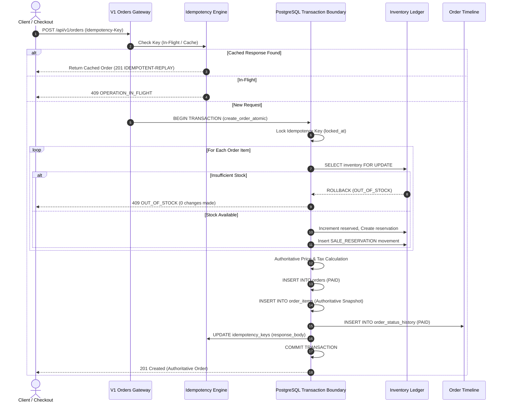

# BaeMeds USA — Order Transaction Architecture & Boundary Design

## 1. Architectural Mandate

In enterprise Durable Medical Equipment (DME) commerce, an order cannot be treated as a collection of decoupled REST calls. Creating an order record while failing to reserve inventory, or charging a customer when stock is unavailable, is unacceptable.

The BaeMeds order placement engine establishes an **atomic boundary** executed entirely within a single PostgreSQL transaction (`create_order_atomic`).

---

## 2. The Single Atomic Transaction Boundary



### 2.1 Atomic Entities Covered

A single transaction establishes all of the following:
1. **Idempotency Key Lock**: Enforces single-execution semantics.
2. **Authoritative Price & Catalog Verification**: Fetches real price and prescription requirements from `products` under server authority. Frontend prices are ignored.
3. **Pessimistic Inventory Row Locking**: Row locks acquired via `SELECT FOR UPDATE` on `warehouse_inventory`.
4. **Inventory Reservations**: Inserted into `inventory_reservations` with TTL.
5. **Inventory Movement Ledger**: Appended to `inventory_movements` as `SALE_RESERVATION`.
6. **Authoritative Tax Snapshot**: Calculated using Delaware tax exemption rules for DME ($0.00 tax in DE) or jurisdictional rates.
7. **Order Master Record**: Inserted into `orders`.
8. **Order Items Snapshot**: Inserted into `order_items` with unit price, quantity, and total.
9. **Order Status History**: Inserted into `order_status_history` recording the initial transition.
10. **Idempotency Cache Commit**: Stores response body for repeated lookups.

If any check fails (e.g. an item is out of stock, invalid quantity, or inactive product), the database **rolls back all mutations entirely**. No orphaned reservations, phantom orders, or inconsistent balances can exist.

---

## 3. Server-Authoritative Price & Calculation Security

Client applications are inherently untrusted in enterprise healthcare technology. The server recalculates all values:

```sql
-- Authoritative catalog price retrieval
select id, title, price, sku, prescription_required, is_active
into v_prod
from public.products
where id = v_item_prod_id;

-- Recalculate line total using database price
v_item_price := v_prod.price;
v_item_total := round(v_item_price * v_item_qty, 2);
v_subtotal := v_subtotal + v_item_total;
```

Client values for:
* `subtotal`
* `tax`
* `shipping`
* `total`
* `inventory availability`

are strictly discarded. The server computes the authoritative invoice.

---

## 4. Idempotency Specification

### 4.1 Protocol
* Header: `Idempotency-Key: <unique_client_string>`
* Table: `public.idempotency_keys`
  * `key` (Text, Primary Key)
  * `request_path` (Text)
  * `request_hash` (Text, SHA-256 of path + serialized payload)
  * `response_status` (Integer)
  * `response_body` (JSONB)
  * `locked_at` (Timestamptz)
  * `completed_at` (Timestamptz)

### 4.2 Behavior Under Load
* **First Request**: Key is locked, transaction executes, response is recorded with status `201`.
* **Subsequent Sequential Requests (x2, x5)**: Key lookup finds `response_body` is not null. Returns cached payload immediately with flag `idempotent_replay: true`. No database mutations or secondary orders are created.
* **Concurrent Replay (x10 Simultaneous Requests)**: Handled by database row lock (`SELECT FOR UPDATE ON idempotency_keys`). Only one worker acquires lock to process; subsequent workers receive either in-flight status (`409 OPERATION_IN_FLIGHT`) or wait for completion to receive the identical cached order response.
* **Verified in Automated Test Suite**: 10 simultaneous requests with the exact same key generated exactly 1 order in the database and 0 duplicate reservations.

---

## 5. Order Status History Timeline

Every order state change generates an immutable record in `order_status_history`:

| Field | Description |
|---|---|
| `id` | Unique ID (`osh_...`) |
| `order_id` | Foreign key referencing `orders(id)` |
| `from_status` | Status transitioning from (or `NULL` for initial creation) |
| `to_status` | New status (`PAID`, `CLINICAL_REVIEW`, `CANCELLED`, etc.) |
| `actor` | User ID or system service performing mutation |
| `actor_role` | RBAC role (`customer`, `support_agent`, `clinical_specialist`, etc.) |
| `reason` | Explicit audit rationale |
| `request_id` | Associated HTTP request ID (`X-Request-Id`) |
| `created_at` | Immutable timestamp |

The frontend timeline component reads directly from `/api/v1/orders/:id/timeline`. There is no synthetic or hardcoded timeline in the UI.

---

## 6. Failure Recovery Matrix

| Failure Point | System State Before Rollback | Recovery Action | Final Result |
|---|---|---|---|
| **Inventory reservation succeeds, but item validation fails** | Item 1 reserved; Item 2 out of stock | Transaction aborts with `OUT_OF_STOCK` exception | Complete rollback: Item 1 reservation erased, inventory restored to original available balance. |
| **Payment intent verification fails** | Stock reserved in memory | Transaction aborts | Entire transaction rolls back; no order inserted. |
| **Duplicate checkout submission** | Initial order processing | Idempotency lock prevents parallel execution | Single order created; duplicate receives cached result. |
| **Order cancelled by customer or support** | Order status `PAID`, stock `RESERVED` | `OrderTransactionService.cancelOrder()` executed | Status updated to `CANCELLED`, all reservations transitioned to `RELEASED`, stock restored to available, movements logged. |
| **Clinical review rejects order** | Order requires RX, stock held | Rejection handler releases reservations | Reservation marked `RELEASED`, audit reason recorded, stock immediately unreserved. |
| **Checkout session expires (30 min TTL)** | Reservation active | Cron/worker triggers `release_inventory_atomic` | Reservation marked `EXPIRED`, movement logged, stock available to other buyers. |
